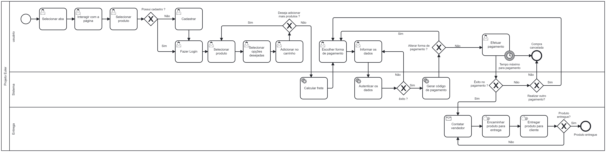

# Informações do Projeto

## Título: PROJETO EULER

## Curso: SISTEMAS DE INFORMAÇÂO

### PARTICIPANTES:

 Os membros do grupo são: 
 * Rafael Sanzio e Silva
 * Matheus Felipe da Silva
 * Thiago Caetano Dantas
 * Lucas Pereira de Souza
 * Pedro Henrique Resende Menezes

# Estrutura do Documento

- [Informações do Projeto](#informações-do-projeto)
  - [Participantes](#participantes)
- [Estrutura do Documento](#estrutura-do-documento)
- [Introdução](#introdução)
  - [Problema](#problema)
  - [Objetivos](#objetivos)
  - [Justificativa](#justificativa)
  - [Público-Alvo](#público-alvo)
- [Especificações do Projeto](#especificações-do-projeto)
  - [Personas e Mapas de Empatia](#personas-e-mapas-de-empatia)
  - [Histórias de Usuários](#histórias-de-usuários)
  - [Requisitos](#requisitos)
    - [Requisitos Funcionais](#requisitos-funcionais)
    - [Requisitos não Funcionais](#requisitos-não-funcionais)
  - [Restrições](#restrições)
- [Projeto de Interface](#projeto-de-interface)
  - [User Flow](#user-flow)
  - [Wireframes](#wireframes)
- [Metodologia](#metodologia)
  - [Divisão de Papéis](#divisão-de-papéis)
  - [Ferramentas](#ferramentas)
  - [Controle de Versão](#controle-de-versão)
- [Modelagem do Processo de Negócio](#modelagem-do-processo-de-negócio)
  - [Análise da Situação Atual](#análise-da-situação-atual)
  - [Descrição dos Processos Aprimorados](#descrição-dos-processos-aprimorados)
- [Projeto da Solução](#projeto-da-solução)
  - [Tecnologias Utilizadas](#tecnologias-utilizadas)
  - [Arquitetura da solução](#arquitetura-da-solução)
- [Avaliação da Aplicação](#avaliação-da-aplicação)
  - [Plano de Testes](#plano-de-testes)
  - [Ferramentas de Testes (Opcional)](#ferramentas-de-testes-opcional)
  - [Registros de Testes](#registros-de-testes)
- [Referências](#referências)

# Introdução

## Problema

A aplicação busca resolver a falta de funcionalidades e versatilidade do site descontinuado de nossa beneficiaria. Feito inicialmente para promover produtos e portifólios autorais do ramo artístico, agora busca continuidade para hospedagem. Para isso, buscamos reduzir custos, atualizar o site de uma Artista e Aromaterapeuta  

## Objetivos

O trabalho de extensão tem como objetivo expandir a visibilidade e a acessibilidade dos serviços oferecidos pela professora de artes Kelly Fonseca, que se incluem como Aromaterapia, arte visual e fotografia, além de realizar trabalhos para caridade e serviços para igreja. Com interesses em relações de pertencimento que estão na memória, no corpo e no espaço. 

O site terá como funcionalidades a exibição de obras em formato de blog, venda de cosméticos e séries de diversas fotografias e desenhos entre outros, exposições que esteve e estará presente e uma aba que descreve todo seu portfolio, cursos e uma pequena biografia.

## Justificativa

O motivo deste trabalho é, através dos conhecimentos adquiridos dento da faculdade, auxíliar alguém que realiza atividade voltada ao próximo (atividade social). No caso desse projeto em questão, visamos por auxiliar a professora de artes Kelly a superar desafios na gestão e divulgação de seu trabalho, esta que realiza cursos e palestras para comunidades como Igrejas e Intituições filantrópicas, ambas sem fins lucreativos. 

Além disso, o trabalho foi pensado em proporcionar um ambiente de aprendizado e desenvolvimento profissional. O mesmo buscar permitir a aplicação e aprofundamento de conhecimento em diversas áreaas da computação, aprendizado de novas tecnologias e o desenvolvimento de habilidades interpessoais essenciais para o sucesso dentro do mercado de trabalho. 

## Público-Alvo

Podemos concluir de forma textual que nosso público alvo se concentra em:

* Amantes de arte;

* Pessoas com problemas físicos ou mentais que buscam tratamento;

* Pessoas que buscam inspiração artística;

* Interessados em comprar produtos de arte ou/e aromaterapia

Através do **Mapa de StakeHolders** podemos ter essa visão:

# Especificações do Projeto

Nessa sessão entraremos em detalhes sobre o usuário que terá acesso ao site, sobre toda a experiência que o mesmo terá sob diferentes pontos de vista ou casos de usos. Falaremos também sobre todas as funções que o sistema deve ser capaz de proporcionar, isso é, conforme os objetivos e problemas então estabelecidos. Por fim, uma visualização prática do que foi desenvolvido por via de interfaces protótipadas, meio que permite técnicas de design sem envolvimento de código ou programa de compilação.

## Personas e Mapas de Empatia

### Persona 1

### Persona 2

### Persona 3

## Histórias de Usuários

Com base na análise das personas forma identificadas as seguintes histórias de usuários:

|EU COMO... `PERSONA`| QUERO/PRECISO ... `FUNCIONALIDADE` |PARA ... `MOTIVO/VALOR`                 |
|--------------------|------------------------------------|----------------------------------------|
|Professora  | Comprar velas artesanais que tranquilizem a mente | Melhorar o ambiente de sala de aula |
|Tatuador       | Saber como divulgar obras | Auxiliar na venda e valorização de minhas obras autorais |
|Estudante de artes | Ganhar inspiriação e aprendizado | Melhorar minhas obras e meu autoconhecimento artístico | 

## Requisitos

As tabelas que se seguem apresentam os requisitos funcionais e não funcionais que detalham o escopo do projeto:

### Requisitos Funcionais

|ID     | Descrição do Requisito  | Prioridade |
|------ |-----------------------------------------|----|
|RF-001 | Banco de Dados | ALTA | 
|RF-002 | Sistema de compras | ALTA |
|RF-003 | Página para detalhes dos produtos  | ALTA |
|RF-004 | Página para perfil da conta | ALTA |
|RF-005 | Menu de produtos/produções | MÉDIA |
|RF-006 | Página de Carrinho de compras  | ALTA |
|RF-007 | Tela de sobre  | MÉDIA |

### Requisitos não Funcionais

|ID     | Descrição do Requisito  |Prioridade |
|-------|-------------------------|----|
|RNF-001| Escalabilidade | ALTA | 
|RNF-002| Usabilidade |  MÉDIA | 
|RNF-003| Confiabilidade |  ALTA | 
|RNF-004| Portabilidade|  BAIXA | 

## Restrições

O projeto está restrito pelos itens apresentados na tabela a seguir.

|ID| Restrição                                             |
|--|-------------------------------------------------------|
|01| O projeto deverá ser entregue até o final do semestre |
|02| Ser desenvolvido em arquitetura monolítica |
|03| Design poluído ou repleto de informações desnecessárias |

# Projeto de Interface

As principais interfaces foram desenvolvidas do projeto se tratam das que convergem entre as áreas de artes e de aromaterapia. Responsáveis por permitir que as duas atividades caraácteristicas da benefíciaria consigam coexixtir no mesmo site, ainda sem desvalorizar um ao outro. 

Tal estratégia soma com as hitórias de usuários, graças ao objetivo de valorizar ambas áreas independente do clinete. Associado aos quesitos de confiabilidade e divulgação dos produtos, a interface busca tratar o usuário de forma pessoal, seja pela paleta de cores acolhedora ou através das informações realativas as obras e a própria beneficiária.

## User Flow

Sequência completa de telas que o usuário pode acessar no site em suas respectivas conexões:

## Wireframes

* Acesso completo e interativo pode ser feito através desse [link](https://www.figma.com/file/qE84wuzvtWN12kfAvU9sXg/WireFrame-Projeto-Euler?type=design&node-id=0%3A1&mode=design&t=XHy2fnJw74t7gdrS-1)

* Descrição tela por tela:
  *  Pré-Menus: Páginas iniciais que dividem qual assunto terá enfâse: Artes ou Aromaterapia
  *  Menus: Aproxima as princípais e mais chamativas informações para reter o usuário 
  *  Lojas e detalhes do produto: Onde é feito a escolha do produto e adção do mesmo ao carrinho do usuário 
  *  Sobres: Informa questões profissionais sobre a beneficiária e suas conexões com a Arte e Aromaterapia 

# Metodologia

Conforme as metódologias ágeis de produção, o projeto se baseia no Scrum e em sua estratégia de produção e avaliação contínua dos resultados de nosso produto. Enquanto para divisão de pepéis e tarefas, o projeto usa o site "Trello" para demais funções de organização e contextualizaçao dos membros quanto seus papéis no desenvolvimento e no processo de criação. A soma de tais metodologias tornam a organização viável e intuitiva, permitindo assim, aos poucos concretizarmos nosso objetivo.  

A implementação do Scrum é essencial na elaboração do design thinking e para gestão das demais ferramentas auxíliares. Propondo os problemas de forma clara com as Sprints e reuniões semanais, fomos capazes de coordenar o que havia de ser feito em seu tempo apropriado. Nesse contexto entra a utilizaçao do GitHub e configuração de sua plataforma, pois na medida que se clareava os meios como progredir com o projeto, a documentação sempre auxília no que ainda havia de ser feito ou pensado. Por fim, o Trello realiza a ponte entre a função de documentar e armazenar (GitHub) com a de organizar e criar metas (Scrum). Nesses elementos que se baseia a metodologia do projeto.

## Divisão de Papéis

É feita baseada em cada integrante e suas reespectivas facilidades, porém, carecendo a todos programarem a partir da Sprint 2:

## Ferramentas

| Ambiente  | Plataforma              |Link de Acesso |
|-----------|-------------------------|---------------|
|Processo de Design Thinkgin  | Figma | [Acesso processo](https://www.figma.com/file/qE84wuzvtWN12kfAvU9sXg/WireFrame-Projeto-Euler?type=design&node-id=0%3A1&mode=design&t=XHy2fnJw74t7gdrS-1) | 
|Repositório de código | GitHub | [Acesso repositório](https://github.com/PSG-TIAPN-2022-1/psg-tiapn-2024-1-projeto-euler/tree/master) | 
|Protótipo Interativo | Figma | [Acesso protótipo](https://www.figma.com/proto/qE84wuzvtWN12kfAvU9sXg/WireFrame-Projeto-Euler?type=design&node-id=1-2&t=kOpakEQUeIKxzg9j-1&scaling=min-zoom&page-id=0%3A1&starting-point-node-id=1%3A2&mode=design) | 
|Editor de código | VS Code |  |
|Ferramenta de comunicação | Teams | Link privado  |
|Ferramenta de diagramação | Lucidchart | none |
|Plataforma de hospedagem | HostGator | none |

## Controle de Versão

Nesse quesito o projeto busca como referência as melhores estrtégias de versionamento e hospedágem em nosso repositório do GitHub. As branchs usadas modelam nomes profissionais usados na industria, tais como: "main", "unstable", "testing", "dev". Enquanto para a gerência dos issues, será usado as seguintes etiquetas: "bugfix","enchancement","feature". 

Os commits seralizados serão realizados com nomes descritivos quanto a suas reespectivas operações, de forma a destacar qual versão do cídigo se trata. Nas demais branch que não sejam a "main" é escrito todas mudanças feitas na versão, assim permitindo a caominicação direta do que foi feito e do que precisa ser feito no próprio arquivo.

# Modelagem do Processo de Negócio
A modelagem dos processos de negócio foi uma etapa crucial na fase de projeto da solução. Para criar os diagramas, utilizamos a ferramenta Camunda Modeler, a partir da qual foram gerados os seguintes diagramas BPMN:
## Análise da Situação Atual

## Descrição dos Processos Aprimorados

# Modelagem de Dados
Na etapa seguinte, realizamos a Modelagem de Dados utilizando as ferramentas Draw.io e BrModelo, resultando na criação dos modelos Conceitual e Lógico.
## Modelo Conceitual

## Modelo Lógico

 

# Projeto da Solução

### Melhoria da Comunicação e Divulgação:
Definir o Público-Alvo: Compreender as necessidades, interesses e canais de comunicação preferidos do público-alvo é fundamental para direcionar as mensagens de forma eficaz.

Estabelecer Mensagens Claras e Concisas: A comunicação deve ser clara, direta e fácil de entender, utilizando linguagem acessível e evitando termos técnicos complexos.

Utilizar Diversos Canais de Comunicação: Diversificar os canais de comunicação permite alcançar um público mais amplo, incluindo mídias sociais, website, e-mail marketing, eventos presenciais e parcerias com outras organizações.

Criar Conteúdo Atraente e Relevante: O conteúdo deve ser informativo, engajador e relevante para o público-alvo, utilizando diferentes formatos como textos, imagens, vídeos e infográficos.

Monitorar e Avaliar os Resultados: É importante monitorar o desempenho das campanhas de comunicação e avaliar os resultados para identificar o que funciona e o que precisa ser ajustado.

### Desenvolver um Website Moderno e Funcional:

Design Intuitivo e Acessível: O website deve ter um design intuitivo e amigável, facilitando a navegação e o acesso às informações.
Conteúdo Informativo e Atualizado: O website deve conter informações completas e atualizadas sobre a organização, seus produtos, serviços e trabalhos ofertados.
Recursos Interativos: Incluir recursos interativos como formulários de contato, área de doações e calendário de eventos pode aumentar o engajamento dos visitantes.

### Utilizar Redes Sociais para Engajamento:

Compartilhar Conteúdo de Qualidade: Publicar conteúdo de qualidade regularmente, como artigos, vídeos e fotos..
Interagir com o Público: Responder a comentários e mensagens, realizar concursos e promoções e conversar com os seguidores são formas de aumentar o engajamento.

## Tecnologias Utilizadas

Para implementar nossa solução, utilizamos as seguintes tecnologias e ferramentas: começando pela criação dos wireframes através do Figma, partindo para o desenvolvimento Front-end, utilizamos as linguagens HTML, CSS e Javascript. Para o desenvolvimento Back-end utilizamos PHP. Atrelado ao Front e Back-end utilizamos a seguinte IDE e ferramentas de desenvolvimento: Visual Studio Code, GitHub, MySQL para o gerenciamento do banco de dados e Hostgator para hospedagem.

A interação do usuário com o sistema vai ser conduzida da seguinte maneira: ao entrar no site o usuário poderá acessar as páginas principais sem a realização do cadastro antecipadamente, haverá uma opção de perfil para caso ele queira cadastrar e fazer login assim que abrir o menu principal, ao fazer login, essa informação é enviada ao banco de dados e permite que esse usuário seja capaz de acessar e comprar os produtos da loja. Ao realizar uma compra, o Back-end envia uma resposta de confirmação para o Front e atualiza o estado da compra. Além disso, com o login feito, o usuário será possibilitado de postar comentários no blog, esses comentários ficarão salvos no banco dados, permitindo que outros usuários também os vejam.

## Arquitetura da solução

......  COLOQUE AQUI O SEU TEXTO E O DIAGRAMA DE ARQUITETURA .......

> Inclua um diagrama da solução e descreva os módulos e as tecnologias
> que fazem parte da solução. Discorra sobre o diagrama.
> 
> **Exemplo do diagrama de Arquitetura**:
> 
> 

# Avaliação da Aplicação

......  COLOQUE AQUI O SEU TEXTO ......

> Apresente os cenários de testes utilizados na realização dos testes da
> sua aplicação. Escolha cenários de testes que demonstrem os requisitos
> sendo satisfeitos.

## Plano de Testes

Foi planejado os possíveis fluxos e decisões que um novo usuário poderia tomar, fluxos que foram planejados através da modelagem TO-BE e AS-IS.

Usuário: Acessa página inicial > Seleciona aba sobre o tema desejado > Realiza o cadastro e faz login > Acessa o restante do site > Insere dados necessários para realizar compra ou comentário

ou

Usuário: Acessa página inicial > Seleciona aba sobre o tema desejado > Tenta acessar algum produto > Obrigatoriamente é levado para a página de cadastro e login > Continua o fluxo normalmente após fazer o login

> Enumere quais cenários de testes foram selecionados para teste. Neste
> tópico o grupo deve detalhar quais funcionalidades avaliadas, o grupo
> de usuários que foi escolhido para participar do teste e as
> ferramentas utilizadas.
> 
> **Links Úteis**:
> - [IBM - Criação e Geração de Planos de Teste](https://www.ibm.com/developerworks/br/local/rational/criacao_geracao_planos_testes_software/index.html)
> - [Práticas e Técnicas de Testes Ágeis](http://assiste.serpro.gov.br/serproagil/Apresenta/slides.pdf)
> -  [Teste de Software: Conceitos e tipos de testes](https://blog.onedaytesting.com.br/teste-de-software/)

## Ferramentas de Testes (Opcional)

......  COLOQUE AQUI O SEU TEXTO ......

> Comente sobre as ferramentas de testes utilizadas.
> 
> **Links Úteis**:
> - [Ferramentas de Test para Java Script](https://geekflare.com/javascript-unit-testing/)
> - [UX Tools](https://uxdesign.cc/ux-user-research-and-user-testing-tools-2d339d379dc7)

## Registros de Testes

Nossos testes indicaram falhas e acertos crítivos para o desenvolvimento do projeto, principalmente no que se trata de obter uma série de informações de um segmento personalizado do site. Acertamos em permitir que apenas usuários logados façam acesso ao perfil, isso controla o acesso não só as informações pessoais como na criação de linhas na tabela de endereços de usuário. Tal perspectiva trás consequências de necessitar compartilhar recursos com a tabela de comentários, essa que não possui controle de qual usuário comentou e permite qualquer um faça essa interação.

A coesão de informações e aproximação de dados entre tabelas é um dos grandes desafios no desenvolvimento do site em conjunto ao seu banco de dados. Permitir que o comentário esteja sempre conectado a postagem, assim como, os endereços estejam vinculados ao perfil é o grande resultado desses testes. Seja a vinculação de dados o exato objetivo para as próximas interações, além de se fundamentalizar nesses o ambiente para os próximos testes. Dessa forma melhorar ainda mais o projeto em questão.

# Referências

......  COLOQUE AQUI O SEU TEXTO ......

> Inclua todas as referências (livros, artigos, sites, etc) utilizados
> no desenvolvimento do trabalho.
> 
> **Links Úteis**:
> - [Formato ABNT](https://www.normastecnicas.com/abnt/trabalhos-academicos/referencias/)
> - [Referências Bibliográficas da ABNT](https://comunidade.rockcontent.com/referencia-bibliografica-abnt/)
